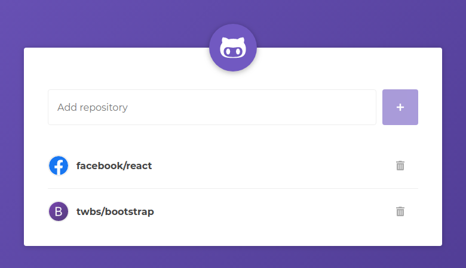
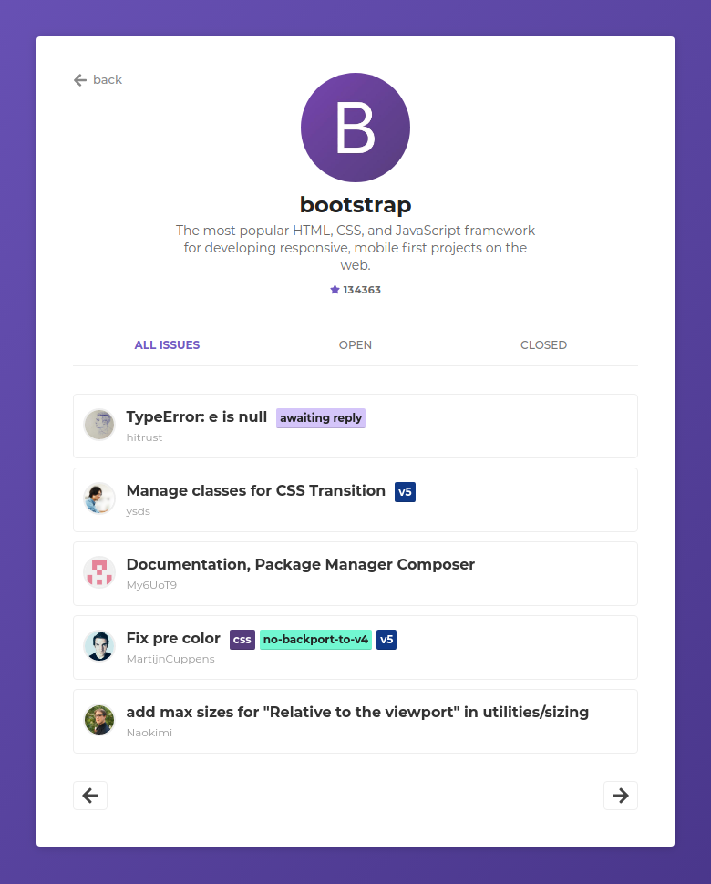

# GitHub Repos
:octocat: Add GitHub _repos_ and see its details and issues

### [Live Demo](https://luizbatanero-github-react.netlify.com/)

<p align="center">
  <a href="https://luizbatanero-github-react.netlify.com/" target="_blank">
    
  </a>
</p>




## :rocket: Technologies

-  [ReactJS](https://reactjs.org/)
-  [React Router v4](https://github.com/ReactTraining/react-router)
-  [Axios](https://github.com/axios/axios)
-  [History](https://www.npmjs.com/package/history)
-  [Polished](https://polished.js.org/)
-  [styled-components](https://www.styled-components.com/)
-  [React-Icons](https://react-icons.netlify.com/)
-  [react-loading-skeleton](https://github.com/dvtng/react-loading-skeleton)
-  [react-loader-spinner](https://github.com/mhnpd/react-loader-spinner)
-  [VS Code][vc] with [EditorConfig][vceditconfig] and [ESLint][vceslint]

## :information_source: How To Use

To clone and run this application, you'll need [Git](https://git-scm.com), [Node.js v10.16][nodejs] or higher + [Yarn v1.13][yarn] or higher installed on your computer. From your command line:

```bash
# Clone this repository
$ git clone https://github.com/henriquecampaner/react-github-repos

# Go into the repository
$ cd react-github-repos

# Install dependencies
$ yarn install

# Run the app
$ yarn start
```

## :memo: License
This project is under the MIT license.

---

Made with ♥ by Henrique Campaner :wave:

[nodejs]: https://nodejs.org/
[yarn]: https://yarnpkg.com/
[vc]: https://code.visualstudio.com/
[vceditconfig]: https://marketplace.visualstudio.com/items?itemName=EditorConfig.EditorConfig
[vceslint]: https://marketplace.visualstudio.com/items?itemName=dbaeumer.vscode-eslint
